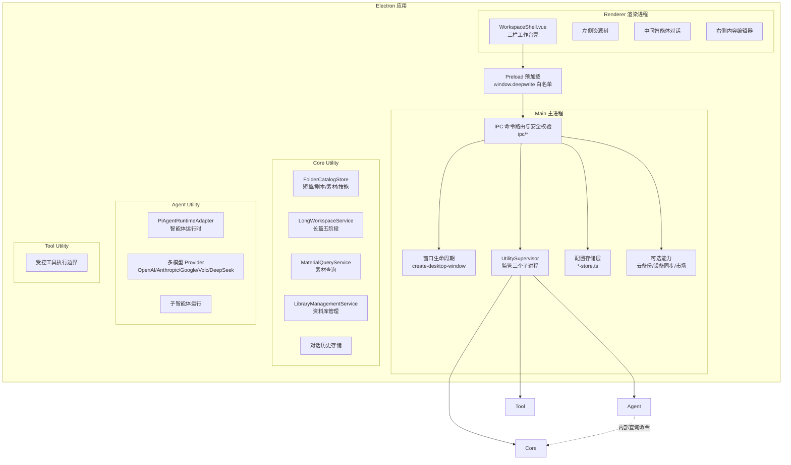
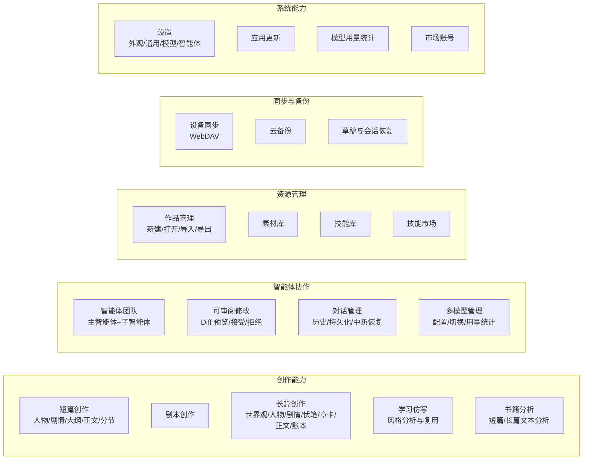
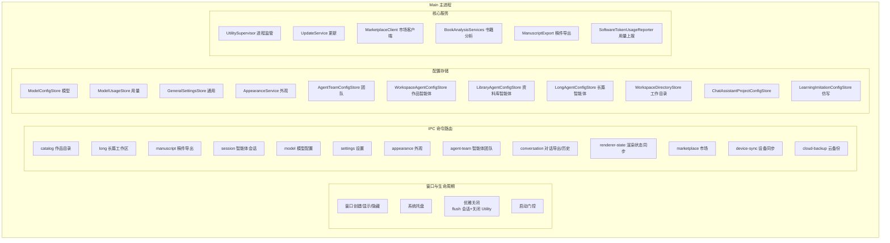
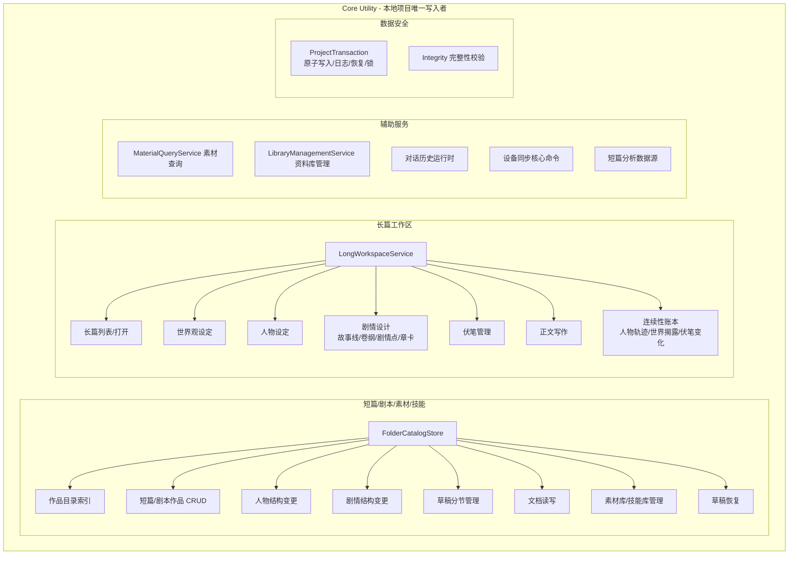
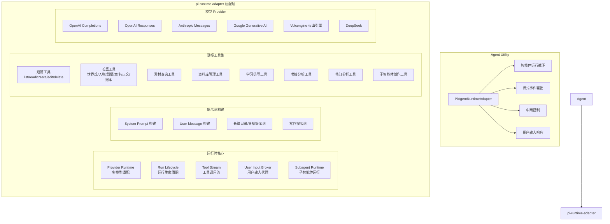
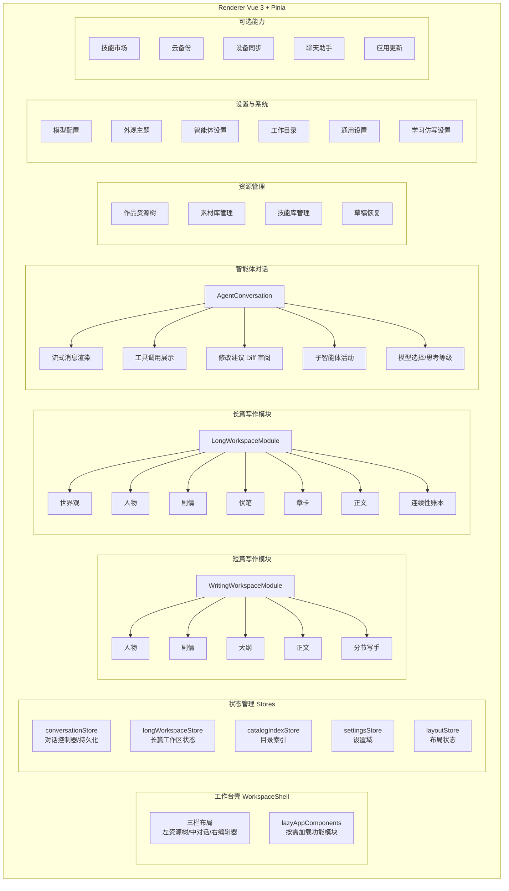
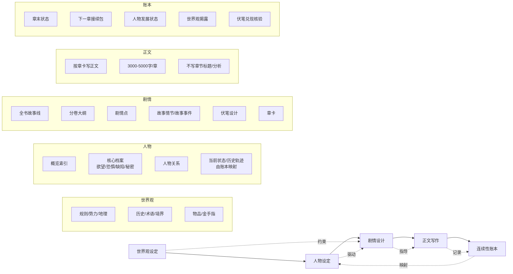
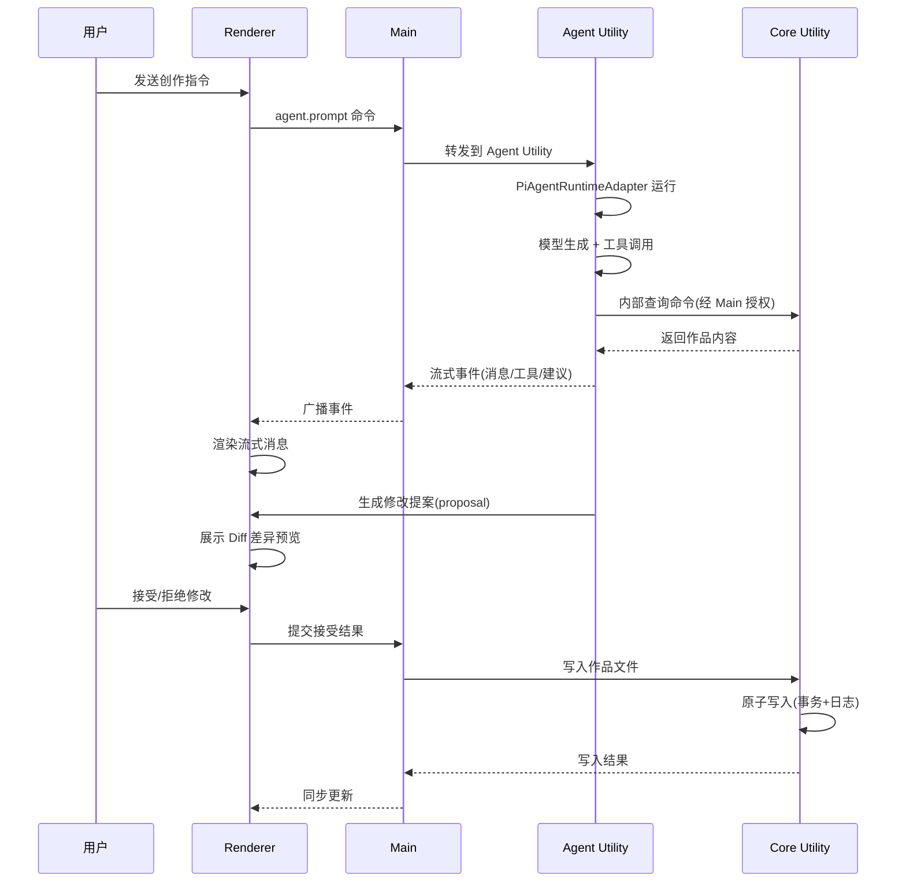
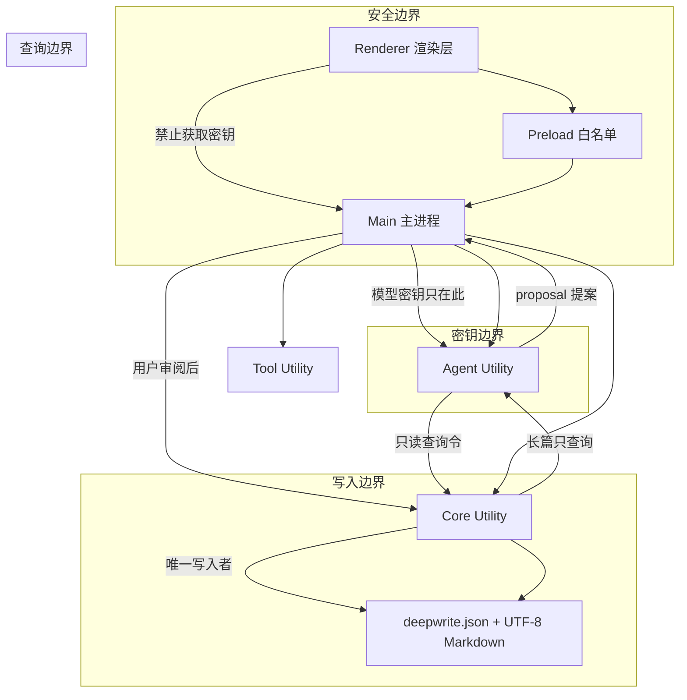

# DeepWrite 功能架构图

> 基于 v1.5.2 代码分析生成。DeepWrite 是面向创作者的本地优先 AI 写作智能体工作台，采用 Electron 多进程架构。

---

## 一、整体进程架构

---

## 二、功能模块总览

---

## 三、主进程 (Main) 功能模块

---

## 四、Core Utility 功能模块

---

## 五、Agent Utility 与运行时适配层

---

## 六、渲染进程 (Renderer) 功能模块

---

## 七、长篇创作五阶段工作流

---

## 八、智能体修改审阅流程

---

## 九、数据流与边界

---

## 十、技术栈与依赖

| 层级 | 技术选型 |
|------|---------|
| 桌面框架 | Electron (utilityProcess 多进程) |
| 打包工具 | electron-vite + electron-builder |
| 前端框架 | Vue 3 (Composition API) + Pinia |
| UI 组件 | Naive UI |
| 契约校验 | Zod |
| 智能体运行时 | Pi SDK (内部运行时) |
| 语言 | TypeScript |
| 包管理 | pnpm workspace |
| 测试 | Vitest |
| 格式/规范 | Prettier + ESLint |
| 状态管理 | Pinia + Composables |
| 模型协议 | OpenAI/Anthropic/Google/Volcengine/DeepSeek |

---

## 关键设计决策

1. **多进程隔离**：Renderer/Preload/Main/Core/Agent/Tool 六个进程，职责单向依赖，密钥不下发渲染层
2. **可审阅写入**：所有智能体修改先生成 proposal，用户接受后才由 Core 原子落盘
3. **本地优先**：作品以 `deepwrite.json` + UTF-8 Markdown 存储，可用 Git/同步盘管理
4. **契约驱动**：`@deepwrite/contracts` 是协议唯一来源，跨进程通信走 Zod 校验的 Envelope
5. **长篇五阶段**：世界观→人物→剧情→正文→账本，共享设定但各阶段独立写入
6. **受控工具边界**：Agent 只能通过预定义工具访问作品，Tool Utility 提供执行隔离
